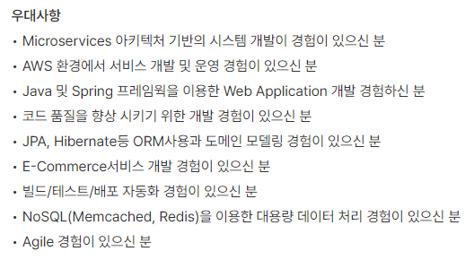

# 대용량 파일 처리 프로젝트

대용량 파일 처리 프로젝트를 진행하며, 배운 내용을 기록하기 위한 템플릿

### 🛠 실습 환경

✔ JDK : AdoptOpenJDK 11

✔ IntelliJ : 2022.2.3

### 👀 프로젝트 기획 배경

✔ 백엔드 개발자에게 대용량 데이터 처리 능력은 필수라고 생각했기 때문

<table>
    <tr>
        <td>
            <em display="block" text-align="center">C기업 백엔드 채용공고</em></td>
		<td>
        	<em display="block" text-align="center">D기업 백엔드 채용공고</em></td>
	</tr>
</table>

✔ Java로도 데이터 가공을 할 수있는지 알아보고 싶었기 때문에

✔ 각 지역의 초중고의 수와 위치를 구함으로써 Java로 대용량 데이터를 원하는 데이터로 가공해보기 위해

### 📑 실습 데이터

공공데이터포털 > 전국초중고등학교위치표준데이터

https://www.data.go.kr/data/15021148/standard.do

### 🧩 Method 설계

| 진행상태             | 구현 Method                                                | 진행 날짜  |
| -------------------- | ---------------------------------------------------------- | ---------- |
| :white_check_mark:   | [파일-읽기](README/파일-읽기.md)                           | 2022.10.06 |
| :white_large_square: | [대용량-데이터-읽기](README/대용량-데이터-읽기.md)         | 2022.10.07 |
| :white_large_square: | [대용량-데이터-가공하기](README/대용량-데이터-가공하기.md) |            |
| :white_large_square: | [읽은-파일-저장하기](README/읽은-파일-저장하기.md)         |            |

