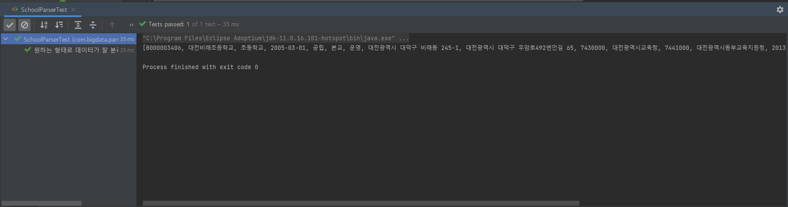
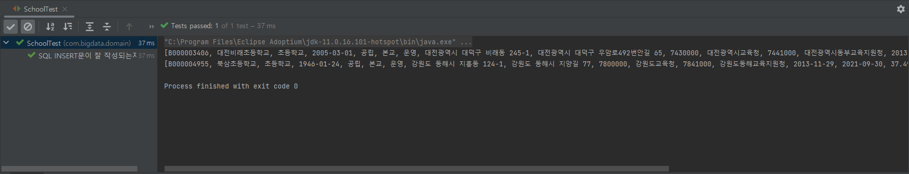

# 대용량 데이터 가공하기

### 1️⃣ 대용량 데이터를 School 객체로 만들기 (String 클래스의 Split() 메서드 활용)

✔ 소스코드 (SchoolParser.java, SchoolParserTest.java)

👇 SchoolParser.java

```java
package com.bigdata.parser;

import com.bigdata.domain.School;

import java.time.LocalDateTime;
import java.util.Arrays;

public class SchoolParser implements Parser<School>{

    @Override
    public School parse(String str) {
        String[] splitted = str.split(",");
        System.out.println(Arrays.toString(splitted));
        String date = splitted[3];
        int year = Integer.parseInt(date.substring(0, 4));
        int month = Integer.parseInt(date.substring(5, 7));
        int day = Integer.parseInt(date.substring(8));
        boolean isMainSchool = (splitted[5].equals("본교")) ? true : false;
        return new School(splitted[0], splitted[1], splitted[2], LocalDateTime.of(year, month, day,0, 0, 0), splitted[4], isMainSchool, splitted[6],splitted[7], splitted[8], splitted[9], splitted[10], splitted[11], splitted[12], Double.parseDouble(splitted[15]), Double.parseDouble(splitted[16]));
    }
}
```

👇 SchoolParserTest.java

```java
package com.bigdata.parser;

import com.bigdata.domain.School;
import org.junit.jupiter.api.DisplayName;
import org.junit.jupiter.api.Test;

import java.time.LocalDateTime;

import static org.junit.jupiter.api.Assertions.*;

class SchoolParserTest {
    SchoolParser schoolParser;

    @Test
    @DisplayName("원하는 형태로 데이터가 잘 분리되어 배열에 저장되는지 테스트")
    public void splitTest() {
        schoolParser = new SchoolParser();
        String line = "B000003406,대전비래초등학교,초등학교,2005-03-01,공립,본교,운영,대전광역시 대덕구 비래동 245-1,대전광역시 대덕구 우암로492번안길 65,7430000,대전광역시교육청,7441000,대전광역시동부교육지원청,2013-11-29,2021-07-05,36.363531243,127.45289438,2021-09-15,7001220,한국교원대학교";
        School school = schoolParser.parse(line);
        assertEquals("B000003406", school.getId());
        assertEquals("대전비래초등학교", school.getName());
        assertEquals(LocalDateTime.of(2005, 03, 01, 0, 0, 0), school.getAnniversary());
        assertEquals("공립", school.getEstablishForm());
        assertTrue(school.getMainSchool());
        assertEquals("운영", school.getOperationalStatus());
        assertEquals("대전광역시 대덕구 비래동 245-1", school.getJiBunAddress());
        assertEquals("대전광역시 대덕구 우암로492번안길 65", school.getRoadNameAddress());
        assertEquals("7430000", school.getSidoOfficeOfEducationCode());
        assertEquals("대전광역시교육청", school.getSidoOfficeOfEducation());
        assertEquals("7441000", school.getSmallOfficeOfEducationCode());
        assertEquals("대전광역시동부교육지원청", school.getSmallOfficeOfEducation());
        assertEquals(36.363531243, school.getLatitude());
        assertEquals(127.45289438, school.getLongitude());
    }
}
```

<br />

**💡 실행 결과**



<br />

<br />

### 2️⃣ School 객체를 이용한 SQL INSERT 쿼리문 작성하기

✔ 소스코드 (School.java, SchoolTest.java)

```java
package com.bigdata.domain;

import java.time.LocalDateTime;

public class School {
    private String id;
    private String name;
    private String grade;
    private LocalDateTime anniversary;
    private String establishForm;
    private boolean mainSchool;
    private String operationalStatus;
    private String jiBunAddress;
    private String roadNameAddress;
    private String sidoOfficeOfEducationCode;
    private String sidoOfficeOfEducation;
    private String smallOfficeOfEducationCode;
    private String smallOfficeOfEducation;
    private Double latitude;  // 위도
    private Double longitude;  // 경도

    public School() {
    }

    public School(String id, String name, String grade, LocalDateTime anniversary, String establishForm, boolean mainSchool, String operationalStatus, String jiBunAddress, String roadNameAddress, String sidoOfficeOfEducationCode, String sidoOfficeOfEducation, String smallOfficeOfEducationCode, String smallOfficeOfEducation, Double latitude, Double longitude) {
        this.id = id;
        this.name = name;
        this.grade = grade;
        this.anniversary = anniversary;
        this.establishForm = establishForm;
        this.mainSchool = mainSchool;
        this.operationalStatus = operationalStatus;
        this.jiBunAddress = jiBunAddress;
        this.roadNameAddress = roadNameAddress;
        this.sidoOfficeOfEducationCode = sidoOfficeOfEducationCode;
        this.sidoOfficeOfEducation = sidoOfficeOfEducation;
        this.smallOfficeOfEducationCode = smallOfficeOfEducationCode;
        this.smallOfficeOfEducation = smallOfficeOfEducation;
        this.latitude = latitude;
        this.longitude = longitude;
    }

    public String getId() {
        return id;
    }

    public String getName() {
        return name;
    }

    public String getGrade() {
        return grade;
    }

    public LocalDateTime getAnniversary() {
        return anniversary;
    }

    public String getEstablishForm() {
        return establishForm;
    }

    public boolean getMainSchool() {
        return mainSchool;
    }

    public String getOperationalStatus() {
        return operationalStatus;
    }

    public String getJiBunAddress() {
        return jiBunAddress;
    }

    public String getRoadNameAddress() {
        return roadNameAddress;
    }

    public String getSidoOfficeOfEducationCode() {
        return sidoOfficeOfEducationCode;
    }

    public String getSidoOfficeOfEducation() {
        return sidoOfficeOfEducation;
    }

    public String getSmallOfficeOfEducationCode() {
        return smallOfficeOfEducationCode;
    }

    public String getSmallOfficeOfEducation() {
        return smallOfficeOfEducation;
    }

    public Double getLatitude() {
        return latitude;
    }

    public Double getLongitude() {
        return longitude;
    }

    public String getSqlInsertQuery() {
        String sql = String.format("INSERT INTO `test-db`.`nation_wide_school`\n" +
                "VALUES\n" +
                "(\"%s\", \"%s\", \"%s\", \"%s\", \"%s\", \"%s\", \"%s\", \"%s\",\n" +
                "\"%s\", \"%s\", \"%s\", \"%s\", \"%s\", \"%s\", \"%s\")",
                this.id, this.name, this.grade, this.anniversary, this.establishForm, this.mainSchool, this.operationalStatus, this.jiBunAddress,
                this.roadNameAddress, this.sidoOfficeOfEducationCode, this.sidoOfficeOfEducation, this.smallOfficeOfEducationCode, this.smallOfficeOfEducation, this.latitude, this.longitude);
        return sql;
    }

    public String getTupleString() {
        String sql = String.format("(\"%s\", \"%s\", \"%s\", \"%s\", \"%s\", \"%s\", \"%s\", \"%s\",\n" +
                "\"%s\", \"%s\", \"%s\", \"%s\", \"%s\", \"%s\", \"%s\")",
                this.id, this.name, this.grade, this.anniversary, this.establishForm, this.mainSchool, this.operationalStatus, this.jiBunAddress,
                this.roadNameAddress, this.sidoOfficeOfEducationCode, this.sidoOfficeOfEducation, this.smallOfficeOfEducationCode, this.smallOfficeOfEducation, this.latitude, this.longitude);

        return sql;
    }
}
```

```java
package com.bigdata.parser;

import com.bigdata.domain.School;
import org.junit.jupiter.api.DisplayName;
import org.junit.jupiter.api.Test;

import java.time.LocalDateTime;

import static org.junit.jupiter.api.Assertions.*;

class SchoolParserTest {
    SchoolParser schoolParser;

    @Test
    @DisplayName("원하는 형태로 데이터가 잘 분리되어 배열에 저장되는지 테스트")
    public void splitTest() {
        schoolParser = new SchoolParser();
        String line = "B000003406,대전비래초등학교,초등학교,2005-03-01,공립,본교,운영,대전광역시 대덕구 비래동 245-1,대전광역시 대덕구 우암로492번안길 65,7430000,대전광역시교육청,7441000,대전광역시동부교육지원청,2013-11-29,2021-07-05,36.363531243,127.45289438,2021-09-15,7001220,한국교원대학교";
        School school = schoolParser.parse(line);
        assertEquals("B000003406", school.getId());
        assertEquals("대전비래초등학교", school.getName());
        assertEquals(LocalDateTime.of(2005, 03, 01, 0, 0, 0), school.getAnniversary());
        assertEquals("공립", school.getEstablishForm());
        assertTrue(school.getMainSchool());
        assertEquals("운영", school.getOperationalStatus());
        assertEquals("대전광역시 대덕구 비래동 245-1", school.getJiBunAddress());
        assertEquals("대전광역시 대덕구 우암로492번안길 65", school.getRoadNameAddress());
        assertEquals("7430000", school.getSidoOfficeOfEducationCode());
        assertEquals("대전광역시교육청", school.getSidoOfficeOfEducation());
        assertEquals("7441000", school.getSmallOfficeOfEducationCode());
        assertEquals("대전광역시동부교육지원청", school.getSmallOfficeOfEducation());
        assertEquals(36.363531243, school.getLatitude());
        assertEquals(127.45289438, school.getLongitude());
    }
    
}
```

<br />

**💡 실행 결과**



<br />

<br />

### 📒 오늘의 회고

오늘 기능을 구현하는 과정에서 다음의 문제점들이 있어 School 클래스를 수정할 일이 많았다.

<pre style="border: 1px dotted orange; padding:10px;">
    1. 받아오고자 하는 <b>데이터가 누락</b>되었음
	2. 위도, 경도를 받아오는 데이터 타입을 온전히 받아오기 위해 <b>Float이 아닌 Double 타입으로 변경</b> 또는 
	   <b>데이터 타입을 잘못 작성</b>한 변수가 있어 수정이 필요했음
	3. SQL INSERT 문을 위한 2가지 메서드를 테스트하기 위해 내가 원하는 결과에 맞게 <b>정확한 문자열(SQL 쿼리문)을 반환</b>하도록
       해야했음
</pre>


이러한 문제점들을 위해 School 클래스를 반복적으로 수정하면서 만약 개인 프로젝트가 아닌 실무에서의 대규모 프로젝트 였다면? 이라는 생각을 해보았다.

만약 실무에서 저런 실수를 했다면 정말 끔찍했을것 같다는 생각을 하게 되었다...😢

앞으로는 이런 실수가 없도록 조금 더 꼼꼼하게 설계를 하고 코드를 작성할 수 있도록 해야겠다.🔥

