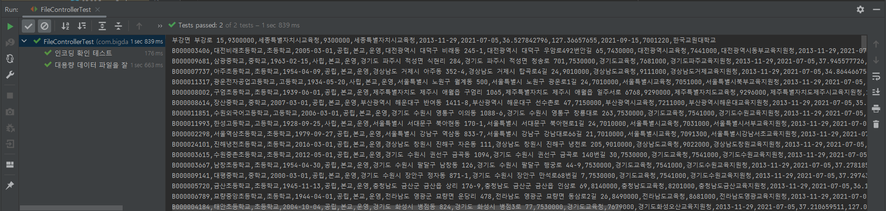

# 대용량 데이터 읽기

### 1️⃣ 대용량 데이터를 읽어오기

✔ 소스 코드 (parser 인터페이스, SchoolParser 클래스, FileController 클래스)

👇 School.java

```java
package com.bigdata.domain;

import java.time.LocalDateTime;

public class School {
    private String id;
    private String name;
    private String grade;
    private LocalDateTime anniversary;
    private String establishForm;
    private boolean mainSchool;
    private String operationalStatus;
    private String jiBunAddress;
    private String roadNameAddress;
    private String sidoOfficeOfEducationCode;
    private String sidoOfficeOfEducation;
    private String smallOfficeOfEducationCode;
    private String smallOfficeOfEducation;
    private Double latitude;  // 위도
    private Double longitude;  // 경도

    public School() {
    }

    public School(String id, String name, String grade, LocalDateTime anniversary, String establishForm, boolean mainSchool, String operationalStatus, String jiBunAddress, String roadNameAddress, String sidoOfficeOfEducationCode, String sidoOfficeOfEducation, String smallOfficeOfEducationCode, String smallOfficeOfEducation, Double latitude, Double longitude) {
        this.id = id;
        this.name = name;
        this.grade = grade;
        this.anniversary = anniversary;
        this.establishForm = establishForm;
        this.mainSchool = mainSchool;
        this.operationalStatus = operationalStatus;
        this.jiBunAddress = jiBunAddress;
        this.roadNameAddress = roadNameAddress;
        this.sidoOfficeOfEducationCode = sidoOfficeOfEducationCode;
        this.sidoOfficeOfEducation = sidoOfficeOfEducation;
        this.smallOfficeOfEducationCode = smallOfficeOfEducationCode;
        this.smallOfficeOfEducation = smallOfficeOfEducation;
        this.latitude = latitude;
        this.longitude = longitude;
    }

    public String getId() {
        return id;
    }

    public String getName() {
        return name;
    }

    public String getGrade() {
        return grade;
    }

    public LocalDateTime getAnniversary() {
        return anniversary;
    }

    public String getEstablishForm() {
        return establishForm;
    }

    public boolean getMainSchool() {
        return mainSchool;
    }

    public String getOperationalStatus() {
        return operationalStatus;
    }

    public String getJiBunAddress() {
        return jiBunAddress;
    }

    public String getRoadNameAddress() {
        return roadNameAddress;
    }

    public String getSidoOfficeOfEducationCode() {
        return sidoOfficeOfEducationCode;
    }

    public String getSidoOfficeOfEducation() {
        return sidoOfficeOfEducation;
    }

    public String getSmallOfficeOfEducationCode() {
        return smallOfficeOfEducationCode;
    }

    public String getSmallOfficeOfEducation() {
        return smallOfficeOfEducation;
    }

    public Double getLatitude() {
        return latitude;
    }

    public Double getLongitude() {
        return longitude;
    }
}

```

👇 Parser.java

```java
package com.bigdata.parser;

import com.bigdata.domain.School;

public interface Parser<T> {
    T parse(String str);
}
```

👇 SchoolParser.java

```java
package com.bigdata.parser;

import com.bigdata.domain.School;

public class SchoolParser implements Parser<School>{

    @Override
    public School parse(String str) {
        System.out.println(str);

        return new School();
    }
}
```

👇 FileController.java

```java
package com.bigdata.parser;

import org.mozilla.universalchardet.UniversalDetector;

import java.io.*;
import java.util.ArrayList;
import java.util.List;

public class FileController<T> {

    Parser<T> parser;

    public FileController(Parser<T> parser) {
        this.parser = parser;
    }

    public String findFileEncoding(String path) throws IOException {
        byte[] buf = new byte[4096];
        FileInputStream fis = new FileInputStream(new File(path));

        UniversalDetector detector = new UniversalDetector(null);

        int bufSize;
        while ((bufSize = fis.read(buf)) > 0 && !detector.isDone()) {
            detector.handleData(buf, 0, bufSize);
        }

        detector.dataEnd();

        String encoding = detector.getDetectedCharset();
        if (encoding != null) {
            System.out.println("Detected encoding = " + encoding);
        } else {
            System.out.println("No encoding detected.");
        }

        detector.reset();

        return encoding;
    }

    public List<T> readLines(String path, String encoding) throws IOException {
        List<T> fileContents = new ArrayList<>();

        BufferedReader br;


        br = new BufferedReader(new InputStreamReader(new FileInputStream(path), encoding));
        String line;
        br.readLine();
        while((line = br.readLine()) != null) {
            fileContents.add(parser.parse(line));
        }

        return fileContents;
    }
}
```


### 📒 오늘의 회고

대용량 파일을 읽어오는 기능을 구현하는 과정에서 파일의 인코딩을 잘 몰라서 계속  **java.nio.charset.MalformedInputException : Input length = 1** 에러가 발생하였다. 

이를 해결하기 위해 읽어오고자 하는 파일의 인코딩을 확인하는 법을 찾아서 적용해보는 시간을 가졌다.

https://code.google.com/archive/p/juniversalchardet/

👆 위의 사이트에서 juniversalchardet-1.0.3.jar 파일을 다운로드 받아 의존성을 추가해주었다.

그리고 File을 다루기 위한 클래스인 FileController.java의 findFileEncoding() 메서드와 이를 테스트하기 위한 FileControllerTest.java의 findFileEncoding() 메서드를 작성하여 확인하였다.

```java
 public String findFileEncoding(String path) throws IOException {
    byte[] buf = new byte[4096];
    FileInputStream fis = new FileInputStream(new File(path));

    UniversalDetector detector = new UniversalDetector(null);

    int bufSize;
    while ((bufSize = fis.read(buf)) > 0 && !detector.isDone()) {
        detector.handleData(buf, 0, bufSize);
    }

    detector.dataEnd();

    String encoding = detector.getDetectedCharset();
    if (encoding != null) {
        System.out.println("Detected encoding = " + encoding);
    } else {
        System.out.println("No encoding detected.");
    }

    detector.reset();

    return encoding;
}
```

```java
package com.bigdata.parser;

import com.bigdata.domain.School;
import org.junit.jupiter.api.DisplayName;
import org.junit.jupiter.api.Test;

import java.io.IOException;

import static org.junit.jupiter.api.Assertions.*;

class FileControllerTest {
    FileController<School> fileController;
    String path;


    @Test
    @DisplayName("인코딩 확인 테스트")
    void findFlieEncoding() throws IOException {
        path = "C:\\pjt\\전국초중등학교위치표준데이터.csv";
        fileController = new FileController(new SchoolParser());

        String encoding = fileController.findFileEncoding(path);
        System.out.println(encoding);  // 현재 파일 인코딩이 무엇인지 출력해보기
        assertNotEquals("UTF-8", encoding);
    }

}
```


**💡 실행 결과**



이렇게 오늘은 깔끔하게 대용량 파일을 읽어오는 것을 배울 수 있었다. ✌😊✌